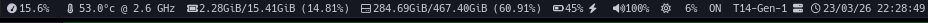

# Bumblebee-status – Configuración personalizada



Esta carpeta contiene mi configuración personalizada para [bumblebee-status](https://github.com/tobi-wan-kenobi/bumblebee-status), una barra de estado modular para i3 y otros gestores de ventanas. En lugar de instalar bumblebee-status desde el repositorio de código fuente completo, aquí solo se incluyen los archivos que uso. La instalación completa de bumblebee-status debe realizarse por separado (desde AUR, pip o el repositorio oficial).

## Instalación de bumblebee-status

### Opción 1: Desde el gestor de paquetes de tu distribución

**Arch Linux / AUR**:

```bash
yay -S bumblebee-status
```

### Desde pip (para cualquier distribución):

```bash
pip install bumblebee-status
```

### Opción 2: Clonar el repositorio original (solo si necesitas modificar )

Si planeas modificar los módulos o el código fuente, clona el repositorio oficial y colócalo donde prefieras, por ejemplo:

```bash
git clone https://github.com/tobi-wan-kenobi/bumblebee-status.git ~/.config/bumblebee-status
```

### Configuración personalizada

En este repositorio, los archivos que **debes colocar en tu sistema** son:

- **Script de lanzamiento** (opcional): `launch.sh` – simplifica la llamada a bumblebee-status con los parámetros deseados.
- **Tema personalizado** (si lo tienes): `themes/iceberg-custom.json` o cualquier tema modificado.
- **Módulos personalizados** (si los creaste): `modules/contrib/mi_modulo.py` y sus tests.

Luego crea un enlace simbólico o añade la ruta a tu `PATH`. En mi configuración de i3, la barra apunta a `~/.config/bumblebee-status/bumblebee-status`

### Ubicación recomendada

- Si instalaste bumblebee-status mediante paquete, la configuración (temas, scripts) suele ir en `~/.config/bumblebee-status/` (crea la carpeta si no existe).
- Si usas la instalación desde fuente (clonado), los temas y módulos personalizados deben colocarse dentro de esa misma estructura, respetando las subcarpetas.

Por ejemplo, para añadir un tema personalizado:

```bash
cp themes/iceberg-custom.json ~/.config/bumblebee-status/themes/
```

Para añadir un módulo personalizado:

```bash
cp modules/contrib/mi_modulo.py ~/.config/bumblebee-status/modules/contrib/
```

Si prefieres mantener todo junto en tu directorio de i3, puedes crear un enlace simbólico:

```bash
ln -s ~/.config/i3/bumblebee-status ~/.config/bumblebee-status
```

## Integración con i3 (mi config)

|  |  |  |  |  |
| ------------------------------------------------------------ | ------------------------------------------------------------ | ------------------------------------------------------------ | ------------------------------------------------------------ | ------------------------------------------------------------ |
|  |  |  |  |  |


En mi configuración modular de i3, el bloque `bar` se encuentra en `conf.d/05-bbar.conf`. Su contenido es:

```bash
bar {
    position top
    tray_output primary
    status_command ~/.config/bumblebee-status/bumblebee-status\
    -t iceberg \
    -m cmus cpu sensors memory disk battery pipewire brightness keyboard hostname datetime
          colors {
            # background #222222ff
            background #222222
            statusline #eeeeee
            separator #666666
            #                    border  bakgr.  text
            focused_workspace   #005818 #00450b #ffffff
            active_workspace    #000445 #00450b #ffffff
            inactive_workspace  #000445 #555555 #888888
            urgent_workspace    #2f343a #900000 #ffffff
    }
}
```

O utiliza un script de lanzamiento para la barra:

```bash
#!/bin/bash
exec ~/.config/bumblebee-status/bumblebee-status \
    -t iceberg \
    -m cmus cpu sensors memory disk battery pipewire brightness keyboard hostname datetime

```

Si tu instalación de bumblebee-status está en una ruta diferente, ajusta la línea `exec` con la ruta correcta.

Dale permisos de ejecución y muevelo a donde quieras:

```bash
chmod +x launch.sh
mv launch.sh ~/.config/bumblebee-status
```

Haci quedaría el archivo

```bash
bar {
    position top
    tray_output primary
    status_command ~/.config/bumblebee-status/launch.sh
    colors {
        background #222222
        statusline #eeeeee
        separator #666666
        focused_workspace   #005818 #00450b #ffffff
        active_workspace    #000445 #00450b #ffffff
        inactive_workspace  #000445 #555555 #888888
        urgent_workspace    #2f343a #900000 #ffffff
    }
}
```


### Módulos utilizados

Los módulos que he habilitado son:

- `cmus` – reproductor de música (necesita `cmus` instalado)
- `cpu` – uso de CPU
- `sensors` – temperatura del sistema (necesita `lm-sensors`)
- `memory` – uso de memoria
- `disk` – uso de disco
- `battery` – estado de la batería
- `pipewire` – volumen (si usas PipeWire; si usas PulseAudio, reemplaza por `pulseaudio`)
- `brightness` – brillo (necesita `brightnessctl`)
- `keyboard` – script custom revisalo si quieres conservarlo
- `hostname` – nombre del equipo
- `datetime` – fecha y hora

Si alguno de estos no te es útil, elimínalo de la lista.

### Personalización adicional

- **Temas**: Puedes modificar el tema `iceberg` o cambiar a otro. Los temas disponibles están en `~/.config/bumblebee-status/themes/` (si instalaste desde paquete) o en la carpeta `themes/` del clon.
- **Opciones de módulos**: Algunos módulos aceptan parámetros. Por ejemplo, para cambiar el formato de fecha, puedes añadir `-p datetime.format="%H:%M"` en la línea de comando.
- **Eventos de click**: bumblebee-status permite ejecutar comandos al hacer click en los módulos. Para ello, consulta la [documentación oficial](https://github.com/tobi-wan-kenobi/bumblebee-status/wiki/Module-configuration).

### Notas

- Si después de recargar i3 la barra no aparece, verifica que bumblebee-status esté instalado correctamente con `which bumblebee-status` y que la ruta en `status_command` sea correcta.
- Si usas `pulseaudio` en lugar de `pipewire`, cambia el módulo en la lista.


