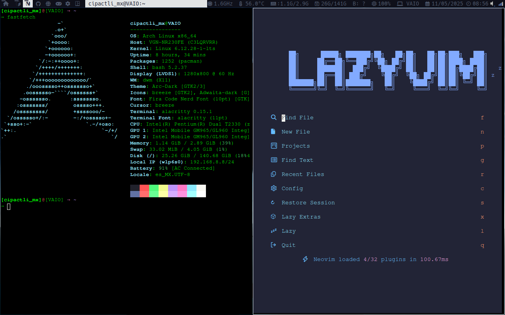

# Introducción

DWM (Dynamic Window Manager) es un administrador de ventanas minimalista y altamente eficiente para X11. Su objetivo principal es proporcionar un entorno rápido, dinámico y personalizable para usuarios avanzados que desean gestionar sus espacios de trabajo con máxima flexibilidad y control. A diferencia de los entornos de escritorio tradicionales, DWM enfatiza la simplicidad y el rendimiento, permitiendo a los usuarios adaptarlo exactamente a sus necesidades.

Esta compilación de DWM está configurada para ajustarse a mi flujo de trabajo, con scripts personalizados y combinaciones de teclas optimizadas para una experiencia fluida. En esta guía encontrarás instrucciones paso a paso para instalar, configurar y personalizar DWM y hacerlo tuyo. Ya seas un veterano de DWM o un usuario primerizo, esta guía te ayudará a aprovechar al máximo este potente administrador de ventanas.

## Captura de pantalla


## Estructura del proyecto

dwm/
├── bar/               # scripts de la barra de estado
│   ├── bar.sh
│   └── scripts/
├── codules/           # código fuente (.c)
├── hodules/           # cabeceras (.h) temáticas
├── core/              # scripts de autostart y configuración
├── docs/              # documentación y capturas
├── patches/           # parches aplicados
├── config.h           # configuración principal
├── config.mk          # configuración de compilación
└── Makefile           # sistema de construcción

## Como instalar DWM

### Primero, instala las dependencias

Las siguientes dependencias son necesarias para compilar DWM:

- `git`: sistema de control de versiones usado para gestionar el código fuente.
- `gcc`: compilador de C.
- `make`: herramienta de construcción.
- `libX11`: biblioteca X11.
- `libXft`: fuentes en X.
- `libXinerama`: soporte para múltiples monitores.

#### Debian

```bash
sudo apt install build-essential git libx11-dev libxft-dev libxinerama-dev
```

#### Arch Linux

```bash
sudo pacman -S base-devel git libx11 libxft libxinerama
```

#### Fedora

```bash
sudo dnf install @development-tools git libX11-devel libXft-devel libXinerama-devel
```

#### Void Linux

```bash
sudo xbps-install -S base-devel git libX11-devel libXft-devel libXinerama-devel
```


## Instalación

#### Opción 1: compilación e instalación estándar

Una vez que instalen las dependencias con su gestor de paquetes o compilándolas manualmente, pueden instalar DWM ejecutando los siguientes comandos:

### Clonar este repositorio

```bash
git clone https://github.com/Ferchupessoadev/dwm.git
```


### Compilar e instalar

```bash
cd dwm
sudo make clean install
```


### Scripts de inicio automático (autostart)

Copia el archivo `autostart.sh` a `~/.local/share/dwm/autostart.sh` porque DWM lo ejecutará:

```bash
mkdir -p ~/.local/share/dwm
cp -r autostart.sh ~/.local/share/dwm/autostart.sh
```


Copia la carpeta `bar` a `~/.config/dwmbar` porque `autostart.sh` la ejecutará:

```bash
cp -r bar ~/.config/dwmbar
```


## Ejecutar DWM con un gestor de pantalla (Display Manager)

Si usas un gestor de pantalla (por ejemplo, LightDM, GDM, SDDM), crea un archivo de sesión:

Crea `/usr/share/xsessions/dwm.desktop` con el siguiente contenido:

ini

```ini
[Desktop Entry]
Name=DWM
Comment=Dynamic Window Manager
Exec=dwm
Type=Application
```


## Cómo crear un atajo de teclado en DWM

```c++
// config.def.h

static const Key keys[] = {
    /* modifier                     key        function        argument */
    {MODKEY, XK_d, spawn, SHCMD("dmenu_run")},
    {MODKEY, XK_r, spawn, SHCMD("dmenu_run_desktop -c -l 10")},
    {MODKEY, XK_Return, spawn, SHCMD("st")},
    {MODKEY, XK_g, spawn, SHCMD("chromium")},
    // otras teclas
};
```


## Licencia

El código de dwm está bajo la licencia MIT (ver `docs/LICENSE`). Los scripts adicionales pueden tener licencias similares.

## Enlaces útiles

- [Sitio oficial de dwm](https://dwm.suckless.org/)
- [Repositorio original](https://git.suckless.org/dwm)
- [Nerd Fonts](https://www.nerdfonts.com/)
